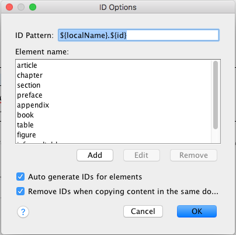

# Preferred Options Oxygen Plugin

This Oxygen plugin automatically loads a preferred set of Global Options each time you start Oxygen.

You can install the add-on by using Oxygen's add-ons support. In Oxygen, go to **Help->Install new add-ons...** 
and use this add-on repository URL:

https://raw.githubusercontent.com/dwcramer/preferred-oxygen-options/master/addon.xml

## Options Set

* In the **DocBook5->ID Options** dialog:
  * **ID Pattern** is set to `${localName}.${id}`
  * **Element name** is set to:
    * article
    * chapter
    * section
    * preface
    * appendix
    * book
    * table
    * figure
    * informaltable
    * informalfigure
  * **Auto generate IDs for elements** is checked
  * **Remove IDs when copying content in the same document** is checked
  
